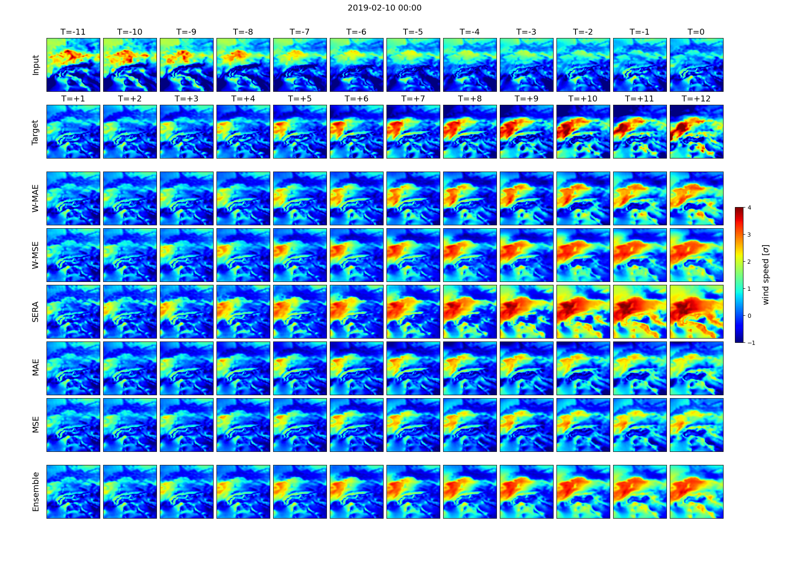

# Deep-RNN-for-extreme-wind-speed-prediction
Paper code for "An adapted convolutional RNN model for spatio-temporal prediction of wind speed extremes in the short-to-medium range for wind energy applications"

Model and training code can be found in `\ConvLSTM_PyTorch_master`. 

Example model forecasts can be found in `\example_forecasts`.

All graphs used in the paper can be found in `\plots`

All figures can be reconstructed in `visualisation_notebook.ipynb`, except for the forecast visualisations, which require that the models in question have been trained and saved using `\ConvLSTM_PyTorch_master/main.py`.   

All scores were computed with `save_scores.py` and have been saved in `\saved_scores_final`. 

Clone repository: 

```
git clone https://github.com/dscheepens/Deep-RNN-for-extreme-wind-speed-prediction.git 
```

## Data 

Wind speed data was obtained from the Copernicus Climate Data Store: https://cds.climate.copernicus.eu/cdsapp#!/dataset/reanalysis-era5-pressure-levels?tab=form. 

Used were 'U-component of wind' and 'V-component of wind' at pressure level 1000 hPa with an hourly interval for a 42 year duration between 1979-2021, between 3-18.75 longitude, 40-55.75 latitude. 

`data_loader.py` requires the data to be in the .npy format, rather than .grib. This can be achieved with the file `grib_to_numpy.py`.

`preprocessing.py` standardises the data and saves it as `era5_standardised.npy` into the specified data root. 

## Results



The first row from the top displays the 12 input frames, the second row the succeeding 12 target frames and the following rows the 12 predicted frames of the models. `T` refers to the index of the frame (in hours), with `T=0` denoting the last input frame and `T=+12` denoting the final target and prediction frames.

## Citation 

```
@Article{egusphere-2022-599,
AUTHOR = {Scheepens, D. R. and Schicker, I. and Hlav\'a\v{c}kov\'a-Schindler, K. and Plant, C.},
TITLE = {An adapted deep convolutional RNN model for spatio-temporal prediction of wind speed extremes in the short-to-medium range for wind energy applications},
JOURNAL = {EGUsphere},
VOLUME = {2022},
YEAR = {2022},
PAGES = {1--28},
URL = {https://egusphere.copernicus.org/preprints/egusphere-2022-599/},
DOI = {10.5194/egusphere-2022-599}
}
```
